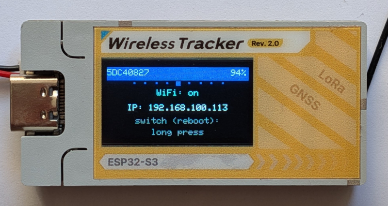
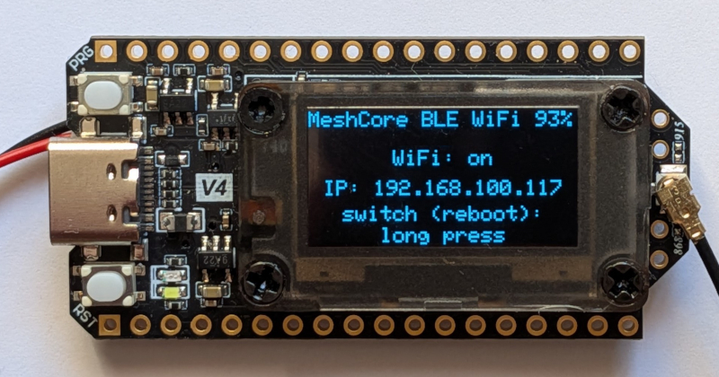

# MeshCore Companion : BLE ou WiFi (exclusif) + USB

---

Firmware communautaire pour le rôle Companion de [MeshCore](https://github.com/meshcore-dev/MeshCore),
basé sur le tag officiel `companion-v1.17.1`. Bluetooth **ou** WiFi, un seul actif à
la fois, la bascule se faisant par un redémarrage complet ; l'USB reste toujours
disponible dans les deux cas. Les paramètres WiFi sont configurables via une page web,
sans installation.

Community firmware for MeshCore's Companion role, based on the official
`companion-v1.17.1` tag. Bluetooth **or** WiFi, only one active at a time, switching
by a full reboot; USB stays available either way. WiFi settings are configurable
through a web page, no installation required.

---

  

**Solution de dépannage, pas un projet officiel.** Ce dépôt existe parce qu'aucun
firmware companion multi-transport n'est encore proposé en amont. Le support natif
déjà présent côté officiel (`MultiSerialInterface`) va clairement dans cette direction :
dès qu'une solution équivalente sera proposée par le projet MeshCore lui-même, ce dépôt
n'aura plus lieu d'être maintenu séparément.

**Note historique** : une première version de ce firmware faisait tourner Bluetooth et
WiFi en même temps (`DUAL_BLE_WIFI`). Ça fonctionne bien sur une board avec PSRAM
(Heltec V4.3), mais bloque indéfiniment la connexion WiFi sur une board sans PSRAM
(Wireless Tracker V2) : les deux radios réservent chacune leurs propres tampons
mémoire au démarrage, ce qui ne laisse pas assez de marge pour que le WiFi termine sa
connexion. Plutôt que de maintenir deux mécanismes différents selon la board, seul le
mode exclusif (`EXCLUSIVE_BLE_WIFI`) est désormais proposé et maintenu, sur les deux
boards.

## Ce que ça apporte

- **BLE actif dès le premier démarrage**, comme n'importe quel companion classique.
- **USB série** (115200 bauds) : le protocole companion complet, en plus du BLE,
  toujours disponible quel que soit le mode actif.
- **WiFi configurable** (SSID/mot de passe), rejoint le réseau au démarrage si activé,
  à la place du BLE (jamais les deux en même temps).
- **Configuration WiFi par chat, depuis l'application** : un contact
  `w_<nom du nœud>` apparaît automatiquement dans la liste de contacts, pour
  lui envoyer les réglages en messages (voir "Utilisation rapide").
- **Page écran dédiée** ("WIFI" et "BLUETOOTH") : un appui long redémarre la carte
  dans l'autre mode.
- **Pourcentage de batterie affiché** (au lieu d'une icône), plus une page dédiée avec
  tension mesurée et plage de référence.
- **Thème sombre** sur l'écran couleur du Wireless Tracker V2 (fond noir, texte clair).
- **Protocole actif signalé en cyan** sur les pages BLUETOOTH et WIFI (gris quand
  désactivé), sur les boards à écran couleur.
- Aucun identifiant WiFi en dur dans le firmware.

## Boards supportées

| Board | Statut |
|---|---|
| Heltec V4 / V4.3 | Testé sur matériel réel, cycle de bascule BLE/WiFi validé (voir `firmware/heltec_v4/`) |
| Heltec Wireless Tracker V2 | Testé sur matériel réel, cycle de bascule BLE/WiFi validé (voir `firmware/heltec_tracker_v2/`) |

## Utilisation rapide

Un [guide](docs/INSTALL.pdf) d'installation plus détaillé (captures, dépannage)
est disponible dans `docs/`.

1. **Flasher** : `firmware/<board>/firmware-merged.bin` (board neuve, à l'offset `0x0`,
   efface tout) ou `firmware.bin` (mise à jour d'un board déjà sous MeshCore, via
   [meshcore.io/flasher](https://meshcore.io/flasher) ou en série).
2. **Configurer le WiFi** : trois méthodes, au choix.
   - **Depuis l'application MeshCore** : utiliser le contact `w_<nom du nœud>`
     figurant dans la liste des contacts pour lui envoyer les réglages en
     message de chat : `wifi_ssid:MonReseau` et `wifi_pwd:MonMotDePasse`
     enregistrent la configuration sans effet immédiat ; `wifi_enabled:1`
     puis `reboot` basculent ensuite le nœud sur le WiFi, qui devient alors
     le seul moyen de le joindre (le BLE s'éteint). Fonctionne partout où
     l'application tourne, Safari/iOS compris.
   - **Depuis la [page de configuration](https://shleepong.github.io/meshcore-companion-ble-wifi-usb/)**
     hébergée par ce dépôt (disponible en français et en anglais), en
     Bluetooth ou en USB, aucune installation requise (Chrome ou Edge,
     Windows ou Android ; Safari/iOS non supporté, restriction du
     navigateur, pas de ce firmware). **Code d'appairage Bluetooth : celui
     affiché sur la page d'accueil de l'écran** (`Pin:XXXXXX`), différent à
     chaque démarrage, pas une valeur fixe. Ce code ne sert qu'au tout
     premier appairage : une fois l'appareil apparié, Windows/Android le
     reconnaît automatiquement aux connexions suivantes (y compris après une
     mise à jour du firmware) sans redemander de code, tant que l'appairage
     n'a pas été supprimé manuellement côté PC/téléphone.
   - **En ligne de commande** : [`meshcore-cli`](https://github.com/meshcore-dev/meshcore-cli),
     voir `set wifi_ssid` / `set wifi_pwd` / `set wifi_enabled`.
3. **Enregistrer** sur la page web : sauvegarde seulement, sans redémarrer. Un
   message indique ensuite si un redémarrage est réellement nécessaire pour que le
   changement prenne effet, avec un bouton dédié pour le faire depuis la page
   elle-même.
4. **Basculer au quotidien** : page "WIFI" ou "BLUETOOTH" sur l'écran de l'appareil,
   appui long sur le bouton. La carte redémarre dans l'autre mode.

## Construire soi-même

Les fichiers `.patch` dans `patches/` s'appliquent dans l'ordre sur le tag officiel
`companion-v1.17.1` du dépôt [meshcore-dev/MeshCore](https://github.com/meshcore-dev/MeshCore).
Voir `patches/README.md` pour le détail de chaque patch et la procédure.

## Problème connu

Après une session USB ouverte puis fermée **depuis le navigateur** (bouton
"Déconnecter" de la page web), l'écran peut rester bloqué sur "Connected" au lieu
d'afficher le code d'appairage Bluetooth, tant que le câble USB n'est pas
physiquement débranché. Limite du cœur Arduino-ESP32 lui-même (la détection de
session USB ne se réinitialise que sur un vrai débranchement, pas sur une simple
fermeture logicielle du port), pas quelque chose de corrigible depuis ce firmware.
N'affecte que l'affichage, pas le fonctionnement réel.

## Licence

MIT, héritée de [meshcore-dev/MeshCore](https://github.com/meshcore-dev/MeshCore)
(voir `LICENSE`). Ce dépôt ne fait qu'ajouter des patchs et des binaires précompilés
par-dessus le code officiel.

*(Pour info : ce dépôt est développé avec Claude Code (Anthropic), en s'appuyant sur
le dépôt officiel MeshCore et le travail qui y est fait.)*

---

  

**Workaround, not an official project.** This repository exists because no
multi-transport companion firmware is offered upstream yet. The native support
already present on the official side (`MultiSerialInterface`) clearly points in this
direction: as soon as an equivalent solution is offered by the MeshCore project
itself, this repository will no longer need to be maintained separately.

**Historical note**: an earlier version of this firmware ran Bluetooth and WiFi at
the same time (`DUAL_BLE_WIFI`). That works fine on a board with PSRAM (Heltec V4.3),
but indefinitely blocks the WiFi connection on a board without PSRAM (Wireless
Tracker V2): both radios each reserve their own memory buffers at boot, which
doesn't leave enough headroom for WiFi to complete its connection. Rather than
maintaining two different mechanisms depending on the board, only the exclusive mode
(`EXCLUSIVE_BLE_WIFI`) is now offered and maintained, on both boards.

## What this brings

- **BLE active from first boot**, like any classic companion.
- **USB serial** (115200 baud): the full companion protocol, in addition to BLE,
  always available whichever mode is active.
- **Configurable WiFi** (SSID/password), joins the network at boot if enabled,
  instead of BLE (never both at the same time).
- **Chat-based WiFi setup, from the app**: a `w_<node name>` contact appears
  automatically in the contact list, to send it the settings as messages
  (see "Quick start").
- **Dedicated screen page** ("WIFI" and "BLUETOOTH"): a long press reboots the board
  into the other mode.
- **Battery percentage displayed** (instead of an icon), plus a dedicated page with
  measured voltage and reference range.
- **Dark theme** on the Wireless Tracker V2's color screen (black background, light
  text).
- **Active protocol shown in cyan** on the BLUETOOTH and WIFI pages (gray when
  disabled), on color-screen boards.
- No hardcoded WiFi credentials in the firmware.

## Supported boards

| Board | Status |
|---|---|
| Heltec V4 / V4.3 | Tested on real hardware, BLE/WiFi switch cycle validated (see `firmware/heltec_v4/`) |
| Heltec Wireless Tracker V2 | Tested on real hardware, BLE/WiFi switch cycle validated (see `firmware/heltec_tracker_v2/`) |

## Quick start

A more detailed installation [guide](docs/INSTALL.pdf) (screenshots,
troubleshooting) is available in `docs/`.

1. **Flash**: `firmware/<board>/firmware-merged.bin` (new board, at offset `0x0`,
   erases everything) or `firmware.bin` (updating a board already running MeshCore,
   via [meshcore.io/flasher](https://meshcore.io/flasher) or serial).
2. **Configure WiFi**: three methods, take your pick.
   - **From the MeshCore app**: use the `w_<node name>` contact listed in
     your contacts, and send it the settings as a chat message:
     `wifi_ssid:MyNetwork` and `wifi_pwd:MyPassword` save the configuration
     with no immediate effect; `wifi_enabled:1` then `reboot` then switch the
     node onto WiFi, which becomes the only way to reach it (BLE turns off).
     Works wherever the app runs, Safari/iOS included.
   - **From the [configuration page](https://shleepong.github.io/meshcore-companion-ble-wifi-usb/)**
     hosted by this repository (available in French and English), over
     Bluetooth or USB, no installation required (Chrome or Edge, Windows or
     Android; Safari/iOS not supported, a browser restriction, not this
     firmware's). **Bluetooth pairing code: the one shown on the device's
     home screen** (`Pin:XXXXXX`), different on every boot, not a fixed
     value. This code is only needed for the very first pairing: once
     paired, Windows/Android reconnects automatically on later connections
     (including after a firmware update) without asking for the code again,
     as long as the pairing hasn't been manually removed on the PC/phone
     side.
   - **Command line**: [`meshcore-cli`](https://github.com/meshcore-dev/meshcore-cli),
     see `set wifi_ssid` / `set wifi_pwd` / `set wifi_enabled`.
3. **Save** on the web page: only saves the settings, without rebooting. A message
   then indicates whether a reboot is actually needed for the change to take
   effect, with a dedicated button to do it right from the page.
4. **Switch day to day**: "WIFI" or "BLUETOOTH" page on the device's screen, long
   press on the button. The board reboots into the other mode.

## Building it yourself

The `.patch` files in `patches/` apply in order on top of the official
`companion-v1.17.1` tag from the [meshcore-dev/MeshCore](https://github.com/meshcore-dev/MeshCore)
repository. See `patches/README.md` for the detail of each patch and the procedure.

## Known issue

After a USB session opened then closed **from the browser** (the web page's
"Disconnect" button), the screen may stay stuck on "Connected" instead of showing
the Bluetooth pairing code, until the USB cable is physically unplugged. A
limitation of the Arduino-ESP32 core itself (the USB session detection only resets
on an actual unplug, not on simply closing the port in software), not something
fixable from this firmware. Only affects the display, not actual operation.

## License

MIT, inherited from [meshcore-dev/MeshCore](https://github.com/meshcore-dev/MeshCore)
(see `LICENSE`). This repository only adds patches and precompiled binaries on top
of the official code.

*(FYI this repository is developed with Claude Code (Anthropic), relying on the
official MeshCore repository and the work done there.)*
